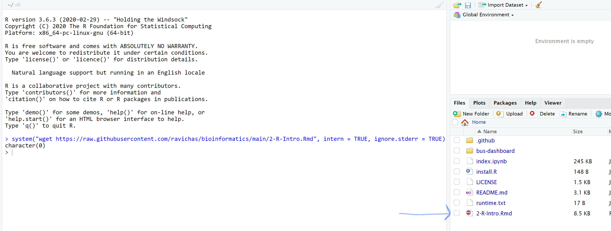

# Bioinformatics software (R/Python) and data

## Linux and NCBI Edirect tutorials
Click the link, https://github.com/ravichas/bioinformatics/blob/main/NCBI_EDIRECT.ipynb 
and then click on "Open in COLAB" radio button 

## R/RStudio tutorial (Please use Google Chrome for this exercise)
Click on the following link, https://github.com/binder-examples/r
Once you are there, click on the "Launch BINDER" option. A new tab will open, and after the server setup, RStudio session will open on the browser. 

system("wget https://raw.githubusercontent.com/ravichas/bioinformatics/main/2-R-Intro.Rmd", intern = TRUE, ignore.stderr = TRUE)

Here are the steps: 

 
 
 
 
 
 
 
 
 
