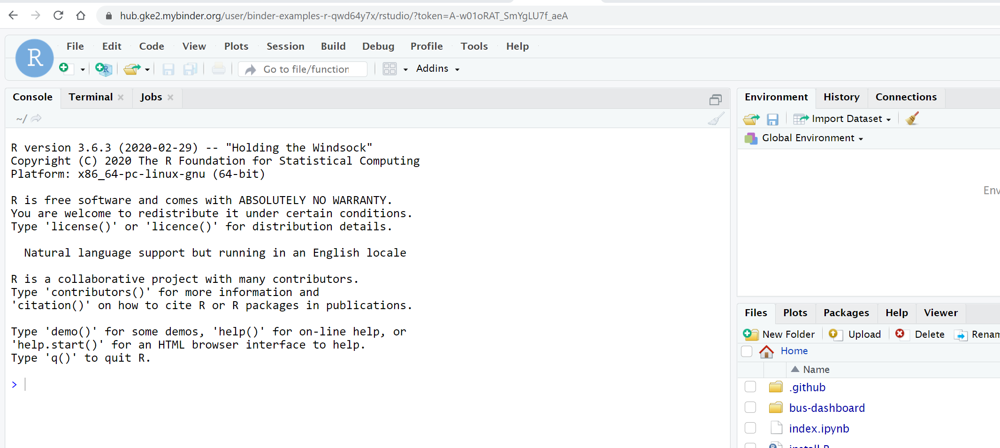

# PLINK Using R/RStudio tutorial 
## (Please use Google Chrome for this exercise)
Click on the following link, https://github.com/binder-examples/r
Once you are there, click on the "RStudio Launch BINDER" option. A new tab will open, and after the server setup, RStudio session will open on the browser. 


Here are the steps: 

 
 
 
 
 Use the following command to get the Rmd file, 
``` 
system("wget https://raw.githubusercontent.com/ravichas/bioinformatics/main/Notebooks/plink.Rmd", intern = TRUE, ignore.stderr = TRUE)
```
And paste the command in the console window (look at the following figure)
 
 
 
 
 Please note that after you ran the above command, plink.Rmd, file was downloaded and appear on the RHS bottom window of the RStudio panel. Click on the file "plink.Rmd" file to get started.

