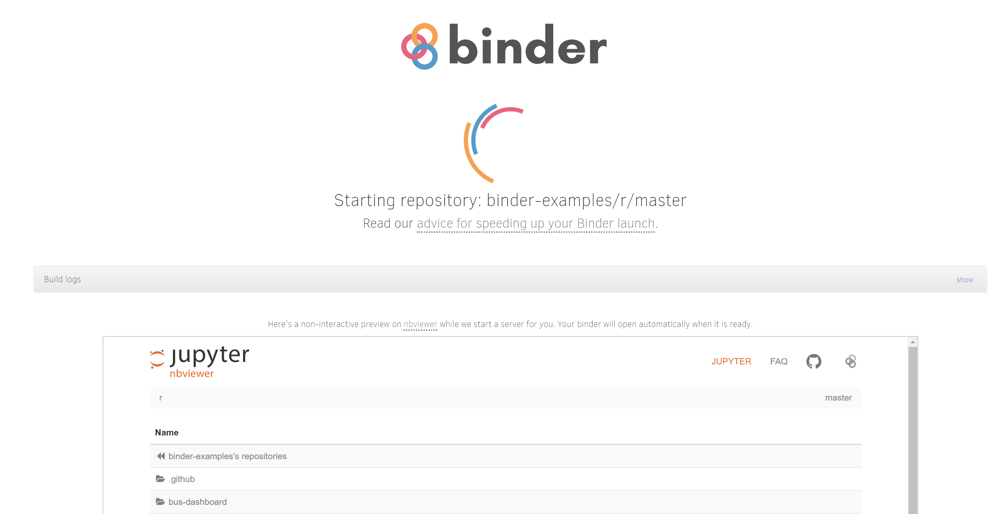
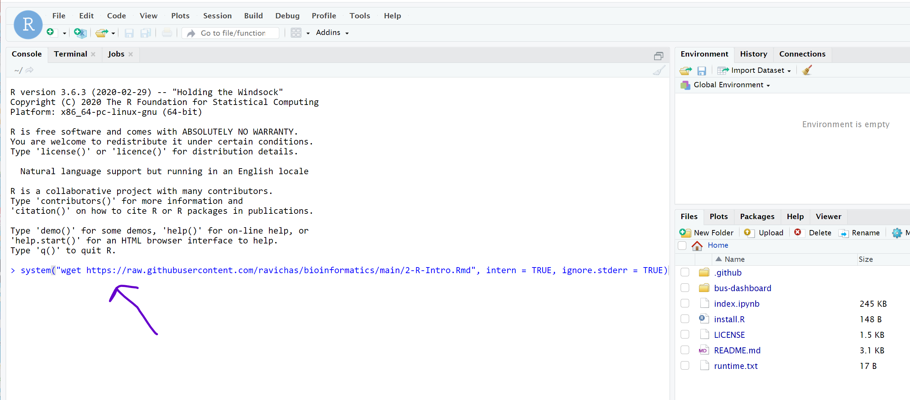

# PLINK Using R/RStudio tutorial 
## (Please use Google Chrome for this exercise)
Click on the following link, https://github.com/binder-examples/r
Once you are there, click on the "RStudio Launch BINDER" option. A new tab will open, and after the server setup, RStudio session will open on the browser. 

Here are the steps: 

 
 
 
 
 Use the following command to get the Rmd file, 
system("wget https://raw.githubusercontent.com/ravichas/bioinformatics/main/Notebooks/plink.Rmd", intern = TRUE, ignore.stderr = TRUE)
 
 
 
 
 
 Click on the file "2-R-Intro.Rmd" file to get started.

